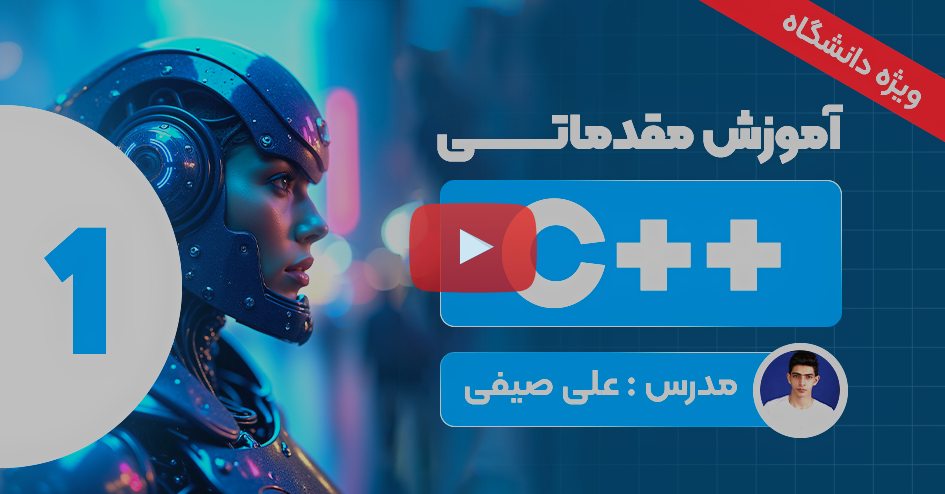

# مقدمه

سی پلاس پلاس یک زبان برنامه نویسی است که با هدف به تکامل رساندن زبان سی به میدان آمده است.

در این جزوه بیشتر به مباحث مورد نیاز دانشگاه می پردازیم و هدف یاد گرفتن سی پلاس پلاس در حد نیاز دانشگاه و تمرینات دانشگاه هست. ولی در انتها منابعی جهت ادامه ی مسیر برای علاقه مندان معرفی خواهم کرد.

# ویدئو یوتیوب

برای این قسمت یک ویدئوی یوتیوب آپلود شده که میتونید داخل اون طریقه ی نصب نرم افزار های مورد نیاز و همینطور توضیحات مطالبی که داخل جزوه گفته شده رو ببینید.

ویدئوی یوتیوب :

# مقدمات برنامه نویسی

برنامه نویسی پل ارتباطی بین انسان و کامپیوتر هست و اگر کسی بخواد به کامپیوتر دستوری بده باید برنامه نویسی بلد باشه یا برنامه ای که یک برنامه نویس دیگه نوشته رو اجرا کنه.

یک سری مفاهیم اولیه داخل برنامه نویسی وجود داره که اول با اونا آشنا میشیم بعد میریم سراغ اصل سی پلاس پلاس و کد نویسی

## انواع زبان های برنامه نویسی

    <ul>
        <li>
            مفسری
        </li>
        <li>
            کامپایلری
        </li>
    </ul>

### زبان های مفسری

به زبان هایی مثل پایتون زبان های مفسری گفته میشه که برای اجرا کردن کد هاشون به یک مفسر نیاز داریم. کار مفسر اینه که بیاد و خط هارو دونه دونه بخونه و تک به تک دستورات رو اجرا کنه

### زبان های کامپایلری

زبان های کامپایلری بر خلاف زبان های مفسری تک به تک اجرا نمیشن، برنامه ای به اسم کامپایلر میاد و همه ی کد هارو می خونه و همه ی این کد هارو به زبان ماشین بر میگردونه و در نهایت یه برنامه ی اجرایی به زبان ماشین درست می کنه و اونو اجرا می کنه (زبان ماشین همون زبانی هست که سیپیو می فهمه و دستورات مستقیما میتونن اونجا اجرا بشن)

### تفاوت زبان های کامپایلری و مفسری
ما یک برنامه که در سومین دستور خودش ارور داره رو هم با پایتون می نویسیم (یک زبان مفسری) هم با سی پلاس پلاس مینویسیم (یک زبان کامپایلری) و هردو رو اجرا می کنیم.

دو دستور اول که ارور نداشتن داخل کد پایتون اجرا میشن و وقتی به دستور سوم رسید برنامه ارور میده و متوقف میشه ولی دستورات قبلی اجرا شدن.

اما داخل سی پلاس پلاس همون دو دستور اول هم اجرا نمیشن چون اشتباه بودن و قابل تبدیل به زبان ماشین نبودن. برای همین قبل از اینکه چیزی اجرا بشه کامپایلر به  ما ارور میده و فرایند متوقف میشه.

تفاوت دیگه ای که باهم دارن سرعت اجرا شدن برنامه هاشون هست. برنامه ای که کامپایل میشه به خاطر اینکه به زبان ماشین برگشته شده خیلی سریع تر از برنامه ای  میشه که با پایتون نوشته شده و مفسر داره اونو اجرا می کنه.

## یک مقدار اطلاعات سخت افزاری

برای اینکه بهتر متوجه فرایندی که برنامه مون در پیش میگیره بشیم بهتره که یک مقدار سخت افزار کامپیوتر یا لپتاپ خودمون رو بشناسیم. اینجا قطعات مختلف رو یه بررسی خیلی کوتاه و کلی می کنیم و میریم سراغ بخش بعد

### CPU

مرکز پردازش یک کامپیوتر سی پی یو هست که تمام محاسباتی که برنامه ی ما قراره انجام بده (دقت داشته باشید که فقط محاسبات و ذخیره سازی اطلاعات نه) توسط سی پی یو انجام میشه. 

### Ram

رم یا حافظه‌ی موقت فضای ذخیره سازی با سرعت خیلی بالاتر از هارد هست که اطلاعات رو میتونه تا زمانی که کامپیوتر روشنه نگه داره. هرجایی که سیپیو نیاز به ذخیره سازی اطلاعات داشته باشه اونارو روی رم میریزه و وقتی بهشون نیاز داشت اونارو از روی رم می خونه.

### Mother Board

مادربرد همون برد الکترونیکی ای هست که سیپیو و رم و ... روی اون قرار میگیرن تا بتونن با هم در ارتباط باشن و البته خیلی کار های دیگه ای مثل رسوندن برق به قطعات و ... هم به کمک این قطعه انجام میشه.

### Storage

در نهایت برای ذخیره سازی دائمی به یک حافظه ی دائمی مثل هارد دیسک یا SSD نیاز داریم. هر اطلاعاتی که لازم باشه به صورت دائمی ذخیره بشه و نگهداری بشه داخل این قطعات ذخیره میشه.

---
در نهایت کامپیوتر ما با همین قطعات شروع به کار می کنه ولی اگر بخوایم به اون مانیتور وصل کنیم و اونو به وایفا وصل کنیم و امکانات دیگه پای قطعات دیگه به وسط میاد که فعلا واردشون نمیشیم داخل این مباحث بهشون نیازی نداریم.

## پسوند فایل ها

احتمالا دیده باشید که هر فایلی که دانلود می کنید یک پسوندی داره که تا حدودی از طریق اون پسوند میشه به ماهیت اون فایل پی برد.

برای مثال اگر یک فایل با پسوند .zip یا .rar دیدیم متوجه میشیم که اون یک فایل فشرده شده است و میتونیم با ابزار های موجود اونارو از حالت فشرده خارج کنیم.

یا فایل هایی با پسوند .jpg و .png  یک فایل تصویری هستن که میتونیم با برنامه ی مشخصی اونارو باز کنیم و محتوای داخلشون رو ببینیم.

پسوند هر فایل تا حدودی برای ما مشخص می کنه که اون فایل چه ماهیتی داره.

داخل برنامه نویسی هم از روی پسوند هر فایل میتونیم متوجه بشیم که اون فایل با چه زبانی نوشته شده چه قالبی داره.

برای مثال فایل های پایتونی با پسوند .py هستند
یا فایل های سی پلاس پلاس با پسوند .cpp هستند.

پس اگر خواستیم یک فایل c++ بسازیم و کد هامونو توش بنویسیم باید پسوند اونو .cpp بزاریم تا مشخص باشه که با C++ نوشته شده.

 
 
 

--- 

به عنوان مقدمه اطلاعات بالا فکر می کنم کافی باشه و داخل فایل بعدی میریم سراغ کد نویسی سی پلاس پلاس و شروع کار اصلیمون.