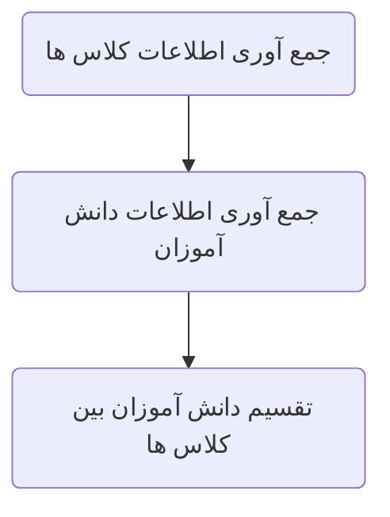

# مقدمه

داخل برنامه نویسی یه مبحث و دیدگاهی وجود داره به اسم شی گرایی یا OOP (Object Oriented Programming). اینجا ما میایم و به دید هرچیزی که توی برنامه است به دید یک شی نگاه می کنیم و سعی می کنیم با فهمیدن ویژگی هایی از اون شی که بهش نیاز داریم اونو توی برنامه مون تعریف کنیم.

این کار باعث میشه تا سرعت تحلیل و توسعه ی برنامه ها بیشتر بشه و کد های تمیز تری داخل برنامه نوشته بشه.

داخل این قسمت دست به کد نمیشیم و اول مفاهیم شی گرایی رو تعریف می کنم و بعد داخل قسمت های بعدی به پیاده سازی این مفاهیم داخل c++ می پردازیم.

# ماهیت شی گرایی

داخل برنامه نویسی دو نوع مدل نوشتن برنامه وجود داره :

### FP : Functional Programming
داخل این مدل از برنامه نویسی از دیدگاه های شی گرایی استفاده نمیشه و برنامه از مجموعه هایی از توابع ساخته میشه.

ساختار کد ها ممکنه نسبت به شی گرایی کمتر تمیز باشه ولی سرعت اجرای این برنامه ها معمولا بیشتر از برنامه هایی هست که از مفهوم شی گرایی استفاده می کنند. دلیل این اتفاق رو جلوتر به طور کامل بررسی می کنیم.

در کل برای نوشتن و توسعه ی یک برنامه ی ساده که قرار نیست در آینده زیاد توسعه پیدا کنه یا سرعت اجرای اون مهم هست بهتره که برنامه رو فانکشنال بنویسیم.

### OOP : Object Oriented Programming
داخل برنامه نویسی شی گرا ما میایم و برنامه رو در قالب یک سری اشیاء می نویسیم که جلوتر بیشتر با مفهوم این اشیاء آشنا میشید.

داخل این روش ساختار کد های ما تمیز تره و راحت تر میشه هر جزء رو داخل برنامه های بزرگ پیدا کرد. برای برنامه هایی که سرعت اجرای اونا خیلی مهم نیست و قراره در آینده توسعه پیدا کنن بهتره که برنامه رو با استفاده از اصول شی گرایی بنویسیم.

داخل برنامه نویسی شی گرا ما میایم و چیزایی که مستقیما در سی پلاس پلاس وجود ندارن رو به عنوان یک شی تعریف می کنیم.
## اشیاء و کلاس ها

برای اینکه بهتر متوجه این قسمت بشید این بخش رو بسط میدیم به استراکچر ها ولی جلوتر متوجه میشیم که این دو مفهوم درسته که شباهت های خیلی زیادی دارن ولی تفاوت هایی هم دارن و یکسان نیستن.

برای اینکه ما بیایم و یک نوع داده ی جدید رو به برنامه بفهمونیم یک استراکچر تعریف می کردیم و با استفاده از اون استراکچر جدید یک متغیر میساختیم و ویژگی های اون رو مشخص می کردیم.

داخل شی گرایی هم کار مشابهی انجام میدیم. یک کلاس جدید که میتونه به عنوان یک نوع داده ی جدید فرض بشه رو معرفی می کنیم و به جای اینکه متغیر هایی از اون بسازیم میایم و آبجکت هایی از اون کلاس میسازیم.

یعنی با این تغییرات داخل تعریف استراکچر ما میتونیم به رابطه ی بین شی و کلاس پی ببریم :
- Structure -> Class
- Variable -> Object

دو مفهوم اصلی و کلیدی داخل برنامه نویسی شی گرا اشیاء (Objects) و کلاس ها (Classes) هستند.

هر کلاس میتونه شامل یکسری ویژگی ها Attributes بشه که ماهیت اون کلاس رو تعریف می کنن.

و هر آبجکتی که از اون کلاس ساخته میشه میتونه بر اساس تعریف کلاسش یکسری ویژگی ها داشته باشه

برای اینکه بهتر متوجه این مورد بشید به مثال های زیر دقت کنید

| Class  | Object 1 | Object 2 | Object 3 |
| ------ | -------- | -------- | -------- |
| میوه   | سیب      | گلابی    | موز      |
| ماشین  | پراید    | بنز      | پژو 405  |
| حیوان  | گوزن     | مرغ      | زرافه    |
| انسان  | علی      | حسین     | محمد     |
| خودکار | بیک      | Canco    | سک سک    |

و همونطور که متوجه شدید هر کلاس در واقع ماهیت همه ی آبجکت هارو در خودش مشخص می کنه.

# دیدگاه شی گرایی

تا اینجا اطلاعات خیلی گنگی در مورد شی گرایی پیدا کردید. ولی احتمالا هنوز نمیدونید کاربرد این شی گرایی داخل یک برنامه ای مثل ماشین حساب یا نرم افزار مدیریت مالی یا هر نرم افزار دیگه ای چیه.

برای اینکه هم بهتر متوجه کاربرد شی گرایی بشید و هم بتونید داخل تحلیل برنامه تون اون برنامه رو به یه سری کلاس ها بشکنید و برنامه رو ساده تر کنید اینجا یک سری مثال های نسبتا عملی و کاربردی تر میزنیم.

## مثال 1 : برنامه ثبت احوال

فرض کنید که یک برنامه داریم و می خوایم داخل اون برنامه یه سری افراد رو با یک سری اطلاعاتشون نگه داریم.

اطلاعاتی که از هر فرد می خوایم نگه داریم :
- کد ملی
- نام 
- نام خانوادگی
- نام پدر
- محل تولد

لیست افرادی که می خوایم توی برنامه نگهداری کنیم :

| کد ملی | نام    | نام خانوادگی | نام پدر | محل تولد |
| ------ | ------ | ------------ | ------- | -------- |
| 121212 | محمد   | قاسمی        | حمید    | اهواز    |
| 131313 | زهرا   | حسینی        | امیر    | اصفهان   |
| 141414 | علیرضا | یعقوبی       | آرش     | تهران    |

### تحلیل برنامه

بخشی که بهمون میگه چه اطلاعاتی از هر شخص لازمه نگه داریم کلاس مارو تعریف می کنه.
و هر ردیف از جدول افرادی که می خوایم داخل برنامه تعریف کنیم یک آبجکت از اون کلاس هستند.

هر کلاس میتونه شامل یک سری ویژگی ها مثل نام ، نام خانوادگی و ... بشه

و در همین حین هر کلاس میتونه شامل یکسری توابع خاص برای آبجکت های خودش باشه. (همونطور که توی استراکچر ها هم دیدیم)

## مثال 2 : فروشگاه کامپیوتر

فرض کنید قراره یک برنامه داشته باشیم که داخل اون می خوان اطلاعات یک سری کامپیوتر رو نگه دارن و قابلیت خرید و فروش کامپیوتر داخل این برنامه وجود داشته باشه.

مشخصاتی که از هر کامپیوتر نیاز داریم ذخیره بشه :
- مدل مادربورد
- مدل سیپیو
- حجم رم
- مدل گرافیک
- حجم حافظه

امکاناتی که برنامه داره :
- خرید کامپیوتر
- فروش کامپیوتر

با اضافه کردن بخش امکانات اومدیم و یکم مثال رو قوی تر کردیم

### تحلیل برنامه 

وضعیت بالا به ما میگه که یک کلاس کامپیوتر داریم که قراره آبجکت های کامپیوتر از روی اون ساخته بشن و این کلاس دو تا تابع هم داره که یکی از اونا خرید کامپیوتره و یکی فروش کامپیوتر.

اینکه دقیقا چطور این تابع باید کار کنه برامون مهم نیست داخل این تحلیل و فعلا صرفا می خوایم یه تحلیل کلی از برنامه داشته باشیم و بعدا وارد جزئیات اون بشیم (داخل قسمت های بعد که وارد کد شدیم بهتر میتونید این مباحث رو بشنویم)

تابع خرید کامپیوتر قراره یک آبجکت کامپیوتر برای ما درست کنه و به لیستمون اضافه کنه و تابع فروش کامپیوتر قراره یکی از کامپیوتر هایی که فروخته شده رو از لیستمون حذف کنه. (فعلا وارد بحث قیمت ها نمیشیم)

## مثال 3 : مدیریت آزمون های قلمچی

آقای کاظم قلمچی اومده به ما گفته که براش یه برنامه درست کنیم تا اطلاعات تمام کلاس هایی که داره و میتونه توشون آزمون برگزار کنه رو داخلش ذخیره کنه و علاوه بر اون اطلاعات دانش آموز هایی که قرار وارد هر کلاس بشن رو هم ذخیره کنیم داخل این برنامه.

مشخصات هر کلاس :
- شماره کلاس
- ظرفیت کلاس
- دانش آموزان کلاس

مشخصات هر دانش آموز :
- کد ملی
- نام
- نام خانوادگی
- حوزه امتحانی

برای تحلیل بهتر به طرز کار سیستم برگزاری آزمون قبل از اینکه این برنامه ساخته بشه نگاه می کنیم :

داخل این برنامه ما با دو نوع موجودیت(`Entity`) مواجه هستیم، دانش آموزان و کلاس(حوزه امتحان) ها.
پس دو تا کلاس داخل برنامه مون باید داشته باشیم :

- دانش آموز
- کلاس(حوزه امتحان)

داخل ویژگی های حوزه های امتحانی یک لیستی از دانش آموزان وجود داره که باعث ایجاد یک ارتباط بین این دو کلاس میشه.

هر کلاس شامل تعدادی دانش آموز میشه و هر دانش آموز یک کلاس داره. جلوتر میفهمید که به این ارتباط یک به چند گفته میشه و ما الان این ارتباط رو با طرز تعریف کلاس هامون ایجاد کردیم.

> شاید الان این مطالب یکم گنگ باشه و ندونید چرا ما داریم اینجوری برنامه رو تحلیل می کنیم. داخل قسمت های بعد که وارد کد شدیم بهتر متوجه این مطالب خواهید شد.

علاوه بر تعریف کلاس ها به کلاس حوزه ی امتحانی یک تابع برای اضافه کردن دانش آموز جدید به اون حوزه اضافه می کنیم.

از این تابع انتظار داریم که اگر ظرفیت کلاس تکمیل شده بود دیگه عضو جدید رو اضافه نکنه و پیغامی رو به عنوان خطا به ما نشون بده.

## جمعبندی

تا اینجا شما با ماهیت کلاس و آبجکت آشنا شدید و نمونه هایی رو هم از ارتباط بین این دو دیدید.
داخل قسمت های بعدی سراغ کد نویسی و تعریف کردن کلاس ها میریم و با مفاهیم شی گرایی بیشتر آشنا میشیم.

---

